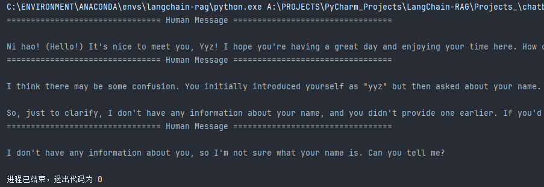

# LangChain RAG 的演示项目构建

## 1 构建聊天机器人 (包含上下文)

### 1.1 导入模型

我将介绍如何设计和实现一个由 LLM 驱动的聊天机器人的示例。这个聊天机器人**能够进行对话并记住之前的交互**。

这个程序将以本地运行的Ollama模型llama3.2:latest为LLM

```python
from langchain_ollama import OllamaLLM
model = OllamaLLM(model='llama3.2:latest')
```

让我们首先直接使用模型。`ChatModel` 是 LangChain“可运行对象”的实例，这意味着它们公开了用于与其交互的标准接口。要简单地调用模型，我们可以将消息列表传递给 `.invoke` 方法

```python
from langchain_core.messages import HumanMessage
print(model.invoke([HumanMessage(content="你好，我是yyz")]))
```

模型本身没有任何状态的概念，**此时它没有将之前的对话轮次纳入上下文**，如果再问他我的名字是什么，它无法回答

为了解决这个问题，我们试着将整个对话历史记录传递给模型

```python
from langchain_core.messages import AIMessage
model.invoke(
    [
        HumanMessage(content="你好，我是yyz"),
        AIMessage(content="大家好！你好，yyz！ (hello, yyz!) 是什么意思呢？你来自哪里？"),
        HumanMessage(content="What's my name?"),
    ]
)
```


如图，它表示已经知道我的名字了。

### 1.2 消息持久化

将我们的聊天模型包装在一个最小的 [LangGraph](https://github.langchain.ac.cn/langgraph/) 应用程序中，使我们能够自动持久化消息历史记录，简化多轮应用程序的开发

```python
from langgraph.checkpoint.memory import MemorySaver
from langgraph.graph import START, MessagesState, StateGraph

# 定义一个新的Graph
workflow = StateGraph(state_schema=MessagesState)

# 定义一个响应模型的函数
def call_model(state: MessagesState):
    response = model.invoke(state["messages"])
    return {"messages": response}

# 定义图形中的（单个）节点
workflow.add_edge(START, "model")
workflow.add_node("model", call_model)

# Add memory
memory = MemorySaver()
app = workflow.compile(checkpointer=memory)
```

现在我们需要创建一个 `config`，每次传递给可运行对象时都需要它。**此配置包含不直接属于输入的一部分，但仍然有用的信息**。在这种情况下，我们希望包含一个 `thread_id`。这应该看起来像这样

```python
config = {"configurable": {"thread_id": "foryyz"}}
```

这使我们能够使用单个应用程序支持多个对话线程，这是应用程序有多个用户时的常见需求

然后我们可以调用应用程序

```python
query = "Hi! I'm yyz."
input_messages = [HumanMessage(query)]
output = app.invoke({"messages": input_messages}, config)
output["messages"][-1].pretty_print()  # output contains all messages in state

query = "What's my name?"
input_messages = [HumanMessage(query)]
output = app.invoke({"messages": input_messages}, config)
output["messages"][-1].pretty_print()
```

此时，我们的聊天机器人记住了关于我们的名字，如果此时将config的`thread_id`更改，再问他我的名字

```python
# 更改 thread_id
config = {"configurable": {"thread_id": "abc123"}}

input_messages = [HumanMessage(query)]
output = app.invoke({"messages": input_messages}, config)
output["messages"][-1].pretty_print()
```

此时我们发现它重新开启了一段对话.



### 1.3 (Can Be Skipped)对于异步的支持

对于异步支持，请更新 `call_model` 节点使其成为异步函数，并在调用应用程序时使用 `.ainvoke`

```python
# Async function for node:
async def call_model(state: MessagesState):
    response = await model.ainvoke(state["messages"])
    return {"messages": response}


# Define graph as before:
workflow = StateGraph(state_schema=MessagesState)
workflow.add_edge(START, "model")
workflow.add_node("model", call_model)
app = workflow.compile(checkpointer=MemorySaver())

# Async invocation:
output = await app.ainvoke({"messages": input_messages}, config):
output["messages"][-1].pretty_print()
```

目前，我们所做的只是在模型周围添加了一个简单的持久化层。我们可以通过添加提示模板使其变得更复杂和个性化。

### 1.4 提示模板

**提示模板**有助于**将原始用户信息转换为 LLM 可以处理的格式**。在这种情况下，原始用户输入只是一条消息，我们将其传递给 LLM。现在让我们使其稍微复杂一些。首先，**让我们添加一条带有自定义指令的系统消息**（但仍然将消息作为输入）。接下来，我们将添加除消息之外的更多输入。

要添加系统消息，我们将创建一个 `ChatPromptTemplate`。我们将利用 `MessagesPlaceholder` 传递所有消息。

```python
from langchain_core.prompts import ChatPromptTemplate, MessagesPlaceholder

prompt = ChatPromptTemplate.from_messages(
    [
        (
            "system",
            "You talk like a pirate. Answer all questions to the best of your ability.",
        ),
        MessagesPlaceholder(variable_name="messages"),
    ]
)
```

现在我们可以更新我们的应用程序以合并此模板

```python
workflow = StateGraph(state_schema=MessagesState)

def call_model(state: MessagesState):
    chain = prompt | model
    response = chain.invoke(state)
    return {"messages": response}

workflow.add_edge(START, "model")
workflow.add_node("model", call_model)

memory = MemorySaver()
app = workflow.compile(checkpointer=memory)
```

以相同的方式调用应用程序

```python
config = {"configurable": {"thread_id": "foryyz1"}}
query = "你好，我的名字是yyz."

input_messages = [HumanMessage(query)]
output = app.invoke({"messages": input_messages}, config)
output["messages"][-1].pretty_print()
```

效果很好


在让我们**使我们的提示稍微复杂一些**。假设提示模板现在看起来像这样

请注意，我们已向提示添加了新的 `language` 输入。我们的应用程序现在有**两个参数**——输入 `messages` 和 `language`。

```python
prompt = ChatPromptTemplate.from_messages(
    [
        (
            "system",
            "You are a helpful assistant. Answer all questions to the best of your ability in {language}.",
        ),
        MessagesPlaceholder(variable_name="messages"),
    ]
)
```

我们更新应用程序的状态以添加language参数。[BaseMessage](https://python.langchain.ac.cn/api_reference/core/messages/langchain_core.messages.base.BaseMessage.html)、[add_messages](https://github.langchain.ac.cn/langgraph/reference/graphs/#langgraph.graph.message.add_messages)

```python
from typing import Sequence

from langgraph.constants import START
from langgraph.graph import StateGraph
from langchain_core.messages import BaseMessage, HumanMessage
from langgraph.graph.message import add_messages
from typing_extensions import Annotated, TypedDict
from langgraph.checkpoint.memory import MemorySaver

class State(TypedDict):
    messages: Annotated[Sequence[BaseMessage], add_messages]
    language: str
    
workflow = StateGraph(state_schema=State)

def call_model(state: State):
    chain = prompt | model
    response = chain.invoke(state)
    return {"messages": [response]}

workflow.add_edge(START, "model")
workflow.add_node("model", call_model)

memory = MemorySaver()
app = workflow.compile(checkpointer=memory)
```

提问

```python
config = {"configurable": {"thread_id": "foryyz2"}}
language = "Chinese"

query = "Hi My name is yyz."
input_messages = [HumanMessage(query)]
output = app.invoke(
    {"messages": input_messages, "language": language},
    config,
)
output["messages"][-1].pretty_print()
```

### 1.5 管理上下文大小 (Token上限)

在构建聊天机器人时，需要理解的一个重要概念是如何管理对话历史记录。如果任其不受管理，消息列表将无限增长，**并可能超出 LLM 的上下文窗口**。因此，**添加一个限制您传递的消息大小**的步骤非常重要。

**重要的是，需要在提示模板之前但加载消息历史记录中的先前消息之后执行此操作。**

我们可以通过在提示前面添加一个简单的步骤来修改 `messages` 键，然后将新的链包装在消息历史记录类中来实现。

```python
from langchain_core.messages import SystemMessage, trim_messages
from langchain_openai import ChatOpenAI
trimmer = trim_messages(
    max_tokens=65,
    strategy="last",
    # 这里使用第三方大模型进行token统计
    token_counter=ChatOpenAI(model="gpt-3.5-turbo",api_key="sk-xxxx", base_url="https://api.bianxie.ai/v1"),
    include_system=True,
    allow_partial=False,
    start_on="human",
)

messages = [
    SystemMessage(content="you're a good assistant"),
    HumanMessage(content="hi! I'm yyz"),
    AIMessage(content="hi!"),
    HumanMessage(content="I like vanilla ice cream"),
    AIMessage(content="nice"),
    HumanMessage(content="whats 2 + 2"),
    AIMessage(content="4"),
    HumanMessage(content="thanks"),
    AIMessage(content="no problem!"),
    HumanMessage(content="having fun?"),
    AIMessage(content="yes!"),
]

print(trimmer.invoke(messages))
```

对于修剪器的更高级的使用：[如何修剪消息 | 🦜️🔗 LangChain 中文](https://python.langchain.ac.cn/docs/how_to/trim_messages/)

要在我们的链中使用它，我们只需要在将 `messages` 输入传递给我们的提示之前运行修剪器即可。

```python
workflow = StateGraph(state_schema=State)

def call_model(state: State):
    chain = prompt | model
    trimmed_messages = trimmer.invoke(state["messages"])
    response = chain.invoke(
        {"messages": trimmed_messages, "language": state["language"]}
    )
    return {"messages": [response]}

workflow.add_edge(START, "model")
workflow.add_node("model", call_model)

memory = MemorySaver()
app = workflow.compile(checkpointer=memory)
```

我们问他两个包含在历史问答中的问题进行测试

```python
# 现在，如果我们尝试询问模型我们的姓名，它将不知道，因为我们修剪了聊天历史记录的那一部分
config = {"configurable": {"thread_id": "foryyz2"}}
query = "What is my name?"
language = "English"

input_messages = messages + [HumanMessage(query)]
output = app.invoke(
    {"messages": input_messages, "language": language},
    config,
)
output["messages"][-1].pretty_print()

# 但是，如果我们询问最近几条消息中的信息，它会记住
config = {"configurable": {"thread_id": "abc678"}}
query = "What math problem did I ask?"
language = "English"

input_messages = messages + [HumanMessage(query)]
output = app.invoke(
    {"messages": input_messages, "language": language},
    config,
)
output["messages"][-1].pretty_print()
```

如图：


### 1.6 流式传输

现在我们已经拥有了一个功能正常的聊天机器人,但是 LLM 有时可能需要一段时间才能做出响应，因此为了改善用户体验，大多数应用程序都会做的一件事是，在生成每个 token 时将其流式传输回。这允许用户看到进度。

默认情况下，我们的 LangGraph 应用程序中的 `.stream` 会流式传输应用程序步骤——在本例中，是模型响应的单个步骤。将 `stream_mode="messages"` 设置为允许我们改为流式传输输出 token

```python
config = {"configurable": {"thread_id": "abc789"}}
query = "Hi I'm yyz, please tell me a joke."
language = "English"

input_messages = [HumanMessage(query)]
for chunk, metadata in app.stream(
    {"messages": input_messages, "language": language},
    config,
    stream_mode="messages",
):
    if isinstance(chunk, AIMessage):  # Filter to just model responses
        print(chunk.content, end="|")
```

### 1.7 完整程序

[LangChain_Basic_Exercise/P1_LangChainBasicChatBot_UseOllamaAndChatGPT.py](https://github.com/foryyz/Programming-Basic-Projects/blob/main/LangChain_Basic_Exercise/P1_LangChainBasicChatBot_UseOllamaAndChatGPT.py)


## x0 环境准备

在开始之前，你需要准备好python环境 ↓

[LangChain Rag | 🫨 Here is yyz!](https://foryyz.top/posts/ai-rag/langchain-rag-basic/#x00-python环境)

链接里的安装好 还有这些：

```powershell
pip install langchain-core langgraph>0.2.27

pip install beautifulsoup4
```

