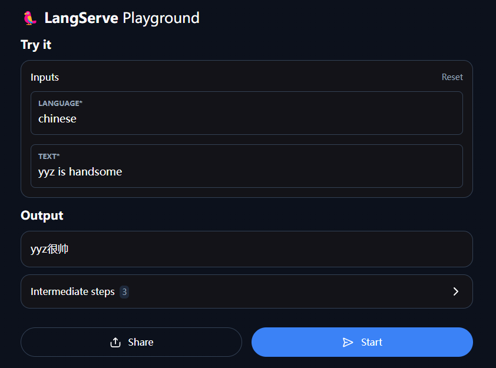

# LangChain - RAG

在执行代码之前你需要准备好python环境:  [Click Me!](#00-python环境)

## 1 使用LangChain创建一个简单 LLM 应用程序

[点击查看效果图](#tp-image-playground)

以**openai**的gpt-3.5-turbo为例

[Introduction | 🦜️🔗 LangChain](https://python.langchain.com/docs/introduction/)

### 1.1 Using Language Models

下面示例直接连接了openai的大模型，更多：[Models的参数: base_url, api_key等](https://python.langchain.com/docs/concepts/chat_models/#standard-parameters)

```python
import os
os.environ["OPENAI_API_KEY"] = "sk-xxxx"

from langchain_openai import ChatOpenAI
# 更多参数查看上面的链接
model = ChatOpenAI(model="gpt-3.5-turbo",api_key="sk-xxxx", base_url="https://api.bianxie.ai/v1")
```

**ChatModel** 是 LangChain “Runnables” 的实例，这意味着它们公开了一个用于与它们交互的标准接口。要简单地调用模型，我们可以将消息列表传递给 .invoke 方法

- [SystemMessage](https://python.langchain.com/api_reference/core/messages/langchain_core.messages.system.SystemMessage.html)
- [HumanMessage](https://python.langchain.com/api_reference/core/messages/langchain_core.messages.human.HumanMessage.html)

```python
from langchain_core.messages import HumanMessage, SystemMessage
messages = [
    # SystemMessage 提示大模型，将接收到的文字翻译成中文
    SystemMessage(content="Translate the following from English into Chinese"),
    # HumanMessage 表示要翻译的文字
    HumanMessage(content="hi!"),
]
model.invoke(messages)
```

查看更多：[Message](https://python.langchain.com/api_reference/core/messages.html)

来自模型的响应也就是`model.invoke(messages)`为 ↓

```
content='你好！' additional_kwargs={'refusal': None} response_metadata={'token_usage': {'completion_tokens': 3, 'prompt_tokens': 20, 'total_tokens': 23, 'completion_tokens_details': {'audio_tokens': None, 'reasoning_tokens': 0}, 'prompt_tokens_details': {'audio_tokens': None, 'cached_tokens': 0}}, 'model_name': 'gpt-3.5-turbo-0125', 'system_fingerprint': None, 'finish_reason': 'stop', 'logprobs': None} id='run-4ebdace1-b84f-45ce-a986-71dac7e2c0f6-0' usage_metadata={'input_tokens': 20, 'output_tokens': 3, 'total_tokens': 23, 'input_token_details': {'cache_read': 0}, 'output_token_details': {'reasoning': 0}}
```

它的类型为：**AIMessage**

### 1.2 OutputParsers - 输出解释器

来自模型的响应是 **AIMessage**。这包含字符串响应以及有关响应的其他元数据。通常，我们可能只想处理字符串 response。我们可以使用简单的输出解析器来解析此响应。

```python
from langchain_core.output_parsers import StrOutputParser
parser = StrOutputParser()

# 方式1.单独使用
result = model.invoke(messages)
parser.invoke(result)

# 方式2.用 输出解释器 来 “链接” 模型。这意味着这个 output parser 将在此链中每次被调用。此链采用语言模型的 input 类型（字符串或消息列表），并返回输出解析器的输出类型（string）。
chain = model | parser # 链接
chain.invoke(messages)
```

### 1.3 Prompt Templates - 提示词模板

[Prompt Templates](https://python.langchain.com/docs/tutorials/llm_chain/#prompt-templates)

这个示例接受两个用户变量:

- `language`: The language to translate text into
- `text`: The text to translate

[聊天提示词模板](https://python.langchain.com/api_reference/core/prompts/langchain_core.prompts.chat.ChatPromptTemplate.html)

```python
from langchain_core.prompts import ChatPromptTemplate
system_template = "Translate the following into {language}:"

# 创建 PromptTemplate
prompt_template = ChatPromptTemplate.from_messages(
    [("system", system_template), ("user", "{text}")]
)
```

此提示模板的输入是字典。我们可以单独使用这个提示模板，**看看它自己做了什么**

```python
result = prompt_template.invoke({"language": "Chinese", "text": "hi"})
print(result)
>>>
ChatPromptValue(messages=[SystemMessage(content='Translate the following into Chinese:'), HumanMessage(content='hi')]) # 可以看到它返回一个由两条消息组成的 ChatPromptValue
```

### 1.4 Chaining with LCEL- 链接

使用竖线 （'|'） 运算符将其与上面的模型和输出解析器相结合：

```python
chain = prompt_template | model | parser
chain.invoke({"language": "chinese", "text": "hi"})
```

这种方法有几个好处，包括优化的流式处理和跟踪支持.

### 1.5 Serving with LangServe - 构建应用程序

[🦜️LangServe](https://python.langchain.com/docs/langserve/)

使用 LangServe 部署应用程序，效果如下：

安装环境 `pip install "langserve[all]"`

##### tp-image-playground



我们需要创建一个serve.py,它将包含三部分

- 我们上面刚刚构建的链的定义
- FastAPI app
- 为链提供服务的路由的定义，该定义由 `langserve.add_routes` 完成

**serve.py**

```python
#!/usr/bin/env python
from fastapi import FastAPI
from langchain_core.prompts import ChatPromptTemplate
from langchain_core.output_parsers import StrOutputParser
from langchain_openai import ChatOpenAI
from langserve import add_routes

# 1. Create prompt template
system_template = "Translate the following into {language}:"
prompt_template = ChatPromptTemplate.from_messages([
    ('system', system_template),
    ('user', '{text}')
])

# 2. Create model
model = ChatOpenAI(model="gpt-3.5-turbo",api_key="sk-xxxx", base_url="https://api.bianxie.ai/v1")

# 3. Create parser
parser = StrOutputParser()

# 4. Create chain
chain = prompt_template | model | parser

# 5. App definition
app = FastAPI(
  title="LangChain Server",
  version="1.0",
  description="A simple API server using LangChain's Runnable interfaces",
)

# 6. Adding chain route
add_routes(
    app,
    chain,
    path="/chain",
)

if __name__ == "__main__":
    import uvicorn

    uvicorn.run(app, host="localhost", port=8000)
```

执行该py程序后，服务将被开启在 [http://localhost:8000](http://localhost:8000/).

此时，我们可以在http://localhost:8000/chain/playground/使用具有**UI界面**的回答窗口

#### 客户端：

现在，让我们设置一个客户端，以便以编程方式与我们的服务交互。使用`langserve.RemoteRunnable`可以与被服务的链进行交互，就像它在客户端运行一样。

```python
from langserve import RemoteRunnable

remote_chain = RemoteRunnable("http://localhost:8000/chain/")
remote_chain.invoke({"language": "English", "text": "Are You GOOD?"})
```

## 2 在本地运行LLM

### 2.1 Ollama

`pip install langchain_ollama`

```python
from langchain_ollama import OllamaLLM

llm = OllamaLLM(model="llama3.2:latest")
print(llm.invoke("金摇杆奖第2名是？"))
```

##  --- --- --- ---

## A1 加载器

- 从目录加载数据
- 加载PDF文件

### A1.1 从目录加载数据

`DirectoryLoader` 接受一个 `loader_cls` 关键字参数，默认为 [UnstructuredLoader](https://python.langchain.ac.cn/docs/integrations/document_loaders/unstructured_file/),它支持解析多种格式，例如 PDF 和 HTML

```python
from langchain_community.document_loaders import DirectoryLoader

# 可以使用 glob 参数来控制要加载的文件。这里它不会加载 .rst 文件或 .html 文件
loader = DirectoryLoader("../data", glob="**/*.md") # 可以添加参数show_progress=True，来开启进度条; 参数use_multithreading=True，来使用多线程; silent_errors=True 开启静默失败，跳过无法加载的文件
docs = loader.load()
print(len(docs))
```

### A1.2 TextLoader

注意：虽然`UnstructuredLoader`解析Markdown标题，但`TextLoader`不会，而且**使用下面的代码加载txt文件会报错**

```python
from langchain_community.document_loaders import TextLoader

# 这里也是加载一个文件夹,加载其中的.md文件
loader = DirectoryLoader("../", glob="**/*.md", loader_cls=TextLoader)
docs = loader.load()
print(docs[0].page_content[:100])
```

#### 使用TextLoader自动检测文件编码

```python
text_loader_kwargs = {"autodetect_encoding": True}
loader = DirectoryLoader(
    "../data", glob="**/*.txt", loader_cls=TextLoader, loader_kwargs=text_loader_kwargs
)
docs = loader.load()
print(docs[0].page_content[:100])
>>> # 正常读取txt文件
金摇杆奖 X GamesRadar 评50款史上最有影响力的游戏:
50 集合啦动物之森（2020）
49 刺客信条 奥德赛（2020）
48 Fez （2021）
```


## A2 文本分割器

#### 加载数据

```python
with open("../data/XgameRadar.txt", 'r', encoding='utf-8') as f:
    state_of_the_union = f.read() # state_of_the_union是str类型数据
```

#### 创建文本分割器

```python
from langchain_experimental.text_splitter import SemanticChunker
from langchain_openai.embeddings import OpenAIEmbeddings

# 使用OpenAI
#text_splitter = SemanticChunker(OpenAIEmbeddings(api_key="sk-xxxx",base_url="https://api.bianxie.ai/v1"))
# 使用Ollama,# 第一个参数，Embedding模型; 第二个参数breakpoint_threshold_type
text_splitter = SemanticChunker(OllamaEmbeddings(model="bge-large:latest"),
                                breakpoint_threshold_type="gradient")

```

#### 分割文本

​	我们以通常的方式分割文本，例如，通过调用 `.create_documents` 来创建 LangChain Document对象

```python
docs = text_splitter.create_documents([state_of_the_union])
print(docs[0].page_content)
```

#### 断点

此分块器通过确定何时“分割”句子来工作。这是通过查看任意两个句子之间嵌入的差异来完成的。当该差异超过某个阈值时，就会将其分割。

有几种方法可以确定该阈值，这些方法由 `breakpoint_threshold_type` 关键字参数控制。

下列是几个关键字参数

- percentile - 百分位数
- standard_deviation - 标准差
- interquartile - 四分位距
- gradient - 梯度

## A3 嵌入模型

[嵌入模型](https://python.langchain.ac.cn/docs/concepts/#embedding-models)

- [如何：嵌入文本数据](https://python.langchain.ac.cn/docs/how_to/embed_text/)
- [如何：缓存嵌入结果](https://python.langchain.ac.cn/docs/how_to/caching_embeddings/)

## A4 向量存储

[如何创建和查询向量数据库 | 🦜️🔗 LangChain 中文](https://python.langchain.ac.cn/docs/how_to/vectorstores/)

在使用向量数据库之前，我们需要加载一些数据并初始化一个嵌入模型。

```python
from langchain_community.document_loaders import TextLoader, DirectoryLoader
from langchain_text_splitters import CharacterTextSplitter

text_loader_kwargs = {"autodetect_encoding": True}
loader = DirectoryLoader(
    "../data", glob="**/*.txt", loader_cls=TextLoader, loader_kwargs=text_loader_kwargs
)
raw_documents = loader.load()

text_splitter = CharacterTextSplitter(chunk_size=1000, chunk_overlap=0)
documents = text_splitter.split_documents(raw_documents)
```

使用 `chroma` 向量数据库

```python
from langchain_chroma import Chroma

db = Chroma.from_documents(documents, OpenAIEmbeddings())
```

### A4.1 相似性搜索

​	所有向量数据库都公开了一个 `similarity_search` 方法。此方法将接收传入的文档，创建它们的嵌入，然后找到所有具有最相似嵌入的文档。

```python
query = "金摇杆奖"
docs = db.similarity_search(query)
print(docs[0].page_content)
```

#### 基于向量的相似性搜索

​	还可以使用 `similarity_search_by_vector` 搜索与给定嵌入向量相似的文档，该方法接受嵌入向量作为参数而不是字符串。

```python
embedding_vector = OllamaEmbeddings(model="bge-large:latest").embed_query(query)
docs = db.similarity_search_by_vector(embedding_vector)
print(docs[0].page_content)
```

**完整代码：**

### A4.1 异步操作

​	[相似性搜索 - 异步操作](https://python.langchain.ac.cn/docs/how_to/vectorstores/#async-operations)


## A5 检索器

检索器是一个接口，它根据非结构化查询返回文档。它比向量存储更通用。检索器不需要能够存储文档，只需要返回（或检索）它们即可。检索器可以从向量存储创建，但也足够广泛，可以包括[维基百科搜索](https://python.langchain.ac.cn/docs/integrations/retrievers/wikipedia/)和[Amazon Kendra](https://python.langchain.ac.cn/docs/integrations/retrievers/amazon_kendra_retriever/)。

检索器以字符串查询作为输入，并以 Document 列表作为输出。

### A5.1 使用向量存储检索数据

它是在向量数据库类周围的一个轻量级包装器，使其符合检索器接口。它使用向量数据库中实现的搜索方法，如相似性搜索和 MMR，来查询向量数据库中的文本。

- 如何从向量数据库实例化一个检索器；
- 如何为检索器指定搜索类型；
- 如何指定其他搜索参数，例如阈值分数和 top-k

#### A5.1.1 从向量数据库创建检索器

使用向量数据库的 `.as_retriever` 方法从向量数据库构建一个检索器

```python
# 首先，我们实例化一个向量数据库。我们将使用一个内存中的 FAISS 向量数据库
from langchain_community.document_loaders import TextLoader
from langchain_community.vectorstores import FAISS
from langchain_openai import OpenAIEmbeddings
from langchain_text_splitters import CharacterTextSplitter

loader = TextLoader("state_of_the_union.txt")

documents = loader.load()
text_splitter = CharacterTextSplitter(chunk_size=1000, chunk_overlap=0)
texts = text_splitter.split_documents(documents)
embeddings = OpenAIEmbeddings()
vectorstore = FAISS.from_documents(texts, embeddings)
```

然后我们可以**实例化一个检索器**

```python
retriever = vectorstore.as_retriever()
#这会创建一个检索器（具体来说是 VectorStoreRetriever），我们可以像往常一样使用它
docs = retriever.invoke("金摇杆奖第2名是?")
```

#### A5.1.2 最大边际相关性检索

默认情况下，向量数据库检索器使用相似性搜索。**如果底层向量数据库支持最大边际相关性搜索**，则可以将其指定为搜索类型

这实际上指定了使用底层向量数据库上的什么方法`similarity_search`、`max_marginal_relevance_search` 等

```python
retriever = vectorstore.as_retriever(search_type="mmr")
docs = retriever.invoke("金摇杆奖第2名是?")
```

### A5.2 传递搜索参数

我们可以使用`search_kwargs`将参数传递给底层向量存储的搜索方法

#### A5.2.1 相似度得分阈值检索

我们可以设置一个相似度得分阈值，并且**只返回得分高于该阈值的文件**

```python
retriever = vectorstore.as_retriever(
    search_type="similarity_score_threshold", search_kwargs={"score_threshold": 0.5}
)
docs = retriever.invoke("金摇杆奖第2名是?")
```

#### A5.2.2 指定top k

我们还可以**限制检索器返回的文件数量** `k`

```python
retriever = vectorstore.as_retriever(search_kwargs={"k": 1})
docs = retriever.invoke("金摇杆奖第2名是?")
len(docs)
```


##  --- --- --- ---

## x0 环境准备

### x0.0 python环境

```powershell
 pip install langchain langchain-community langchain-core langchain-cli
 pip install openai
 pip install "langserve[all]"
 
 # 加载器
 pip install unstructured unstructured[md]
 pip install python-magic-bin
 
 # 分割器
 pip install langchain_experimental langchain_openai
 
 # 向量存储
 pip install langchain-chroma
 
```

### x0.1 LangChain环境配置

#### x0.1.1 

```
import getpass
import os

os.environ["LANGCHAIN_TRACING_V2"] = "true"
os.environ["LANGCHAIN_API_KEY"] = getpass.getpass()
```

#### x0.1.2

```
export LANGCHAIN_TRACING_V2="true"
export LANGCHAIN_API_KEY="..."
```

## x1 接口文档

- [文本加载器](https://python.langchain.ac.cn/docs/how_to/#document-loaders)
  - [document_loaders](https://python.langchain.com/api_reference/community/document_loaders.html)
- [文本分割器](https://python.langchain.ac.cn/docs/concepts/#text-splitters)
  - [分割器使用指南](https://python.langchain.ac.cn/docs/how_to/#text-splitters)
- [检索器](https://python.langchain.ac.cn/docs/how_to/#retrievers)
  - [检索器使用指南](https://python.langchain.ac.cn/docs/how_to/#retrievers)


## x2 一些报错的解决方法

### x2.1 RuntimeError: Error loading ../data/xxxx.txt

通常发生在读取txt文件时，发生这个错误的原因在于TextLoader不知道该文件的编码，可以查看[解决方法](#使用TextLoader自动检测文件编码)
