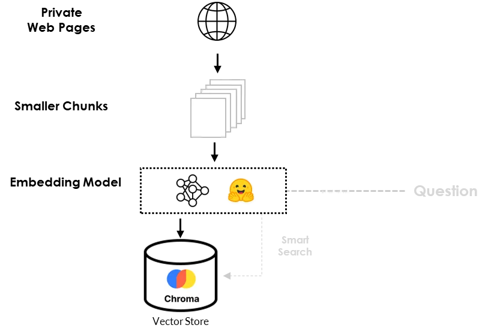

# (Old)Mistral-7b + LangChain + ChromaDB

## 1 环境准备工作

### 1.1 安装Cuda和Cudnn

自行安装

### 1.2 配置Hugging环境变量

- HF_HUB_OFFLINE - 1
- HUGGINGFACEHUB_API_TOKEN - Token

## 2 实战开始

### 2.0 环境准备 

#### 新建一个conda环境并安装pytorch

```powershell
conda create -n rag-langchain python=3.12
conda install pytorch torchvision torchaudio pytorch-cuda=12.4 -c pytorch -c nvidia
```

#### 安装python环境以及相关的包

```
pip install sentencepiece
pip install ipython
pip install gradio
pip install xformer
pip install chromadb
pip install langchain
pip install langchain-community
pip install accelerate
pip install transformers
pip install bitsandbytes
pip install unstructured
pip install sentence-transformers
```

#### 导入相关包

```python
import torch
import gradio as gr

from textwrap import fill
from IPython.display import Markdown, display

from langchain.prompts.chat import (
    ChatPromptTemplate,
    HumanMessagePromptTemplate,
    SystemMessagePromptTemplate,
    )

from langchain import PromptTemplate
from langchain import HuggingFacePipeline

from langchain.vectorstores import Chroma
from langchain.schema import AIMessage, HumanMessage
from langchain.memory import ConversationBufferMemory
from langchain.embeddings import HuggingFaceEmbeddings
from langchain.text_splitter import RecursiveCharacterTextSplitter
from langchain.document_loaders import UnstructuredMarkdownLoader, UnstructuredURLLoader
from langchain.chains import LLMChain, SimpleSequentialChain, RetrievalQA, ConversationalRetrievalChain

from transformers import BitsAndBytesConfig, AutoModelForCausalLM, AutoTokenizer, GenerationConfig, pipeline

import warnings
warnings.filterwarnings('ignore')
```

### 2.1 创建Mistral模型通道

#### 导入相关包

```python
import torch
from langchain_huggingface import HuggingFacePipeline
from transformers import BitsAndBytesConfig, AutoTokenizer, AutoModelForCausalLM, GenerationConfig, pipeline
```

#### 使用Mistral-7b建立文本生成PipeLine

```python
MODEL_NAME = "mistralai/Mistral-7B-Instruct-v0.3"

#使用BitsAndBytesConfig定义量化配置。量化是一种用于降低深度学习模型的内存和计算需求的技术，通常通过使用更少的比特（在我们的情况下为4比特）来表示模型参数
quantization_config = BitsAndBytesConfig(
    load_in_4bit=True,
    bnb_4bit_compute_dtype=torch.float16,
    bnb_4bit_quant_type="nf4",
    bnb_4bit_use_double_quant=True,
)

#初始化Mistral-7b模型的tokenizer，允许您预处理输入到模型的文本数据
tokenizer = AutoTokenizer.from_pretrained(MODEL_NAME, use_fast=True)
tokenizer.pad_token = tokenizer.eos_token

#初始化了用于因果语言建模的预训练语言Mistral-7b模型。该模型配置有各种参数，包括先前设置的量化配置
model = AutoModelForCausalLM.from_pretrained(
    MODEL_NAME, torch_dtype=torch.float16,
    trust_remote_code=True,
    device_map="auto",
    quantization_config=quantization_config
)

#模型创建一个生成配置，指定各种与生成相关的设置，如令牌的最大数量、采样温度、top-p采样和重复惩罚
generation_config = GenerationConfig.from_pretrained(MODEL_NAME)
generation_config.max_new_tokens = 1024
generation_config.temperature = 0.0001
generation_config.top_p = 0.95
generation_config.do_sample = True
generation_config.repetition_penalty = 1.15

#用pipeline函数创建一个文本生成管道。这个管道是为文本生成而设置的，它将预先训练的模型、标记器和生成配置作为输入。它被配置为返回全文输出
pipeline = pipeline(
    "text-generation",
    model=model,
    tokenizer=tokenizer,
    return_full_text=True,
    generation_config=generation_config,
)
```

#### 创建模型通道实例

```python
llm = HuggingFacePipeline(
    pipeline=pipeline,
    )
```

#### 训练前 - 问题测试

问一个正常的问题

```python
query = "Explain the difference between ChatGPT and open source LLMs in a couple of lines."
result = llm(
    query
)

display(Markdown(f"<b>{query}</b>"))
display(Markdown(f"<p>{result}</p>"))
```

问一个它不知道的问题

```python
#query = "When is Zhang Yuyang's birthday?"
query = "What is Hiberus GenIA Ecosystem?"
result = llm(
    query
)

display(Markdown(f"<b>{query}</b>"))
display(Markdown(f"<p>{result}</p>"))
```

### 2.2 配置Embedding模型

```python
# 使用阿里巴巴大摩学院的embedding模型GTE
# 论文地址：https://arxiv.org/abs/2308.03281
embeddings = HuggingFaceEmbeddings(
    model_name="thenlper/gte-large",
    model_kwargs={"device": "cuda"},
    encode_kwargs={"normalize_embeddings": True},
)
```

### 2.3 配置提示词模板

PromptTemplate通过结构化Prompt格式使模型按照用户期望的格式进行输出，模板可以包括指令、few-shot例子以及适合特定任务的特定上下文和问题。

```python
template = """
[INST] <>
Act as a Machine Learning engineer who is teaching high school students.
<>

{text} [/INST]
"""

prompt = PromptTemplate(
    input_variables=["text"],
    template=template,
)
```

效果测试

```python
query = "Explain what are Deep Neural Networks in 2-3 sentences"
result = llm(prompt.format(text=query))

display(Markdown(f"<b>{query}</b>"))
display(Markdown(f"<p>{result}</p>"))
```

### 2.4 数据加载

**数据加载流程图**(看不清黑色字请点击左上角切换主题颜色)



**方式1 - 通过网页加载**

```python
urls = [
    "https://www.hiberus.com/expertos-ia-generativa-ld",
    "https://www.hiberus.com/en/experts-generative-ai-ld"
]

loader = UnstructuredURLLoader(urls=urls)
documents = loader.load()

len(documents)
# Output
```

还可以**(方式2 - 通过本地文件加载)**

#### 数据量较大的解决方法

由于这两个文档数据量较大，以及超过了Mistral-7b大模型的上下文窗口大小，因此我们需要将文档按照1024个tokens大小进行切分，生成21个较小的chunks，并且为了保证上下文的连续性，chunk与chunk直接设置64个重叠tokens，代码如下：

```python
text_splitter = RecursiveCharacterTextSplitter(chunk_size=1024, chunk_overlap=64)
texts_chunks = text_splitter.split_documents(documents)

len(texts_chunks)
```

### 2.5 数据注入 - 存入向量数据库

```python
db = Chroma.from_documents(texts_chunks, embeddings, persist_directory="db")
```

### 2.6 为矢量数据库添加提示词链接

```python
template = """
[INST] <>
Act as an Hiberus marketing manager expert. Use the following information to answer the question at the end.
<>

{context}

{question} [/INST]
"""

prompt = PromptTemplate(template=template, input_variables=["context", "question"])

qa_chain = RetrievalQA.from_chain_type(
    llm=llm,
    chain_type="stuff",
    retriever=db.as_retriever(search_kwargs={"k": 2}),
    return_source_documents=True,
    chain_type_kwargs={"prompt": prompt},
)
```

### 2.7 测试

例子一：

```python
query = "What is GenAI Ecosystem?"
result_ = qa_chain(
    query
)
result = result_["result"].strip()


display(Markdown(f"<b>{query}</b>"))
display(Markdown(f"<p>{result}</p>"))
```

例子二：

```python
query = "Why Hiberus has created GenAI Ecosystem?"
result_ = qa_chain(
    query
)
result = result_["result"].strip()


display(Markdown(f"<b>{query}</b>"))
display(Markdown(f"<p>{result}</p>"))
```

还可以输出源文档

```python
result_["source_documents"]
```

## (可跳过) 3 问答功能实现

为了实现问答功能，我们首先对Prompt模板进行一些调整。然后，我们使用ConversationBufferMemory**将对话存储在内存中**，**然后稍后检索消息**。最后，**使用链接组件**ConversationalRetrievalChain**将**我们的**LLM** Mistral-7b**与矢量数据库和聊天历史相结合**。问答系统整体架构，如下图所示：


```python
custom_template = """You are an Hiberus Marketing Manager AI Assistant. Given the
following conversation and a follow up question, rephrase the follow up question
to be a standalone question. At the end of standalone question add this
'Answer the question in English language.' If you do not know the answer reply with 'I am sorry, I dont have enough information'.
Chat History:
{chat_history}
Follow Up Input: {question}
Standalone question:
"""

CUSTOM_QUESTION_PROMPT = PromptTemplate.from_template(custom_template)

memory = ConversationBufferMemory(memory_key="chat_history", return_messages=True)

qa_chain = ConversationalRetrievalChain.from_llm(
    llm=llm,
    retriever=db.as_retriever(search_kwargs={"k": 2}),
    memory=memory,
    condense_question_prompt=CUSTOM_QUESTION_PROMPT,
)
```

### 3.1 测试

```
query = "Who you are?"
result_ = qa_chain({"question": query})
result = result_["answer"].strip()

display(Markdown(f"<b>{query}</b>"))
display(Markdown(f"<p>{result}</p>"))

```


```
query = "What is GenIA Ecosystem?"

result_ = qa_chain({"question": query})
result = result_["answer"].strip()

display(Markdown(f"<b>{query}</b>"))
display(Markdown(f"<p>{result}</p>"))
```

我们可以通过查看HumanMessages中的问题和AIMessages中的模型响应来获取聊天的历史记录。

```python
memory.chat_memory.messages
```

## (可跳过) 4 基于Gradio搭建问答UI界面

我们设置了一个名为querying()的函数，它将查询作为主要输入，并使用一个名为history的名称巧妙的假参数来解决一个小问题。当启动这个函数时，它会返回模型Mistral-7b生成的响应。

```python
def querying(query, history):
  memory = ConversationBufferMemory(memory_key="chat_history", return_messages=True)

  qa_chain = ConversationalRetrievalChain.from_llm(
      llm=llm,
      retriever=db.as_retriever(search_kwargs={"k": 2}),
      memory=memory,
      condense_question_prompt=CUSTOM_QUESTION_PROMPT,
  )

  result = qa_chain({"question": query})
  return result["answer"].strip()
```

启动Gradio聊天界面

```python

iface = gr.ChatInterface(
    fn = querying,
    chatbot=gr.Chatbot(height=600),
    textbox=gr.Textbox(placeholder="What is GenAI Ecosystem?", container=False, scale=7),
    title="HiberusBot",
    theme="soft",
    examples=["Why Hiberus has created GenAI Ecosystem?",
              "What is GenAI Ecosystem?"],

    cache_examples=True,
    retry_btn="Repetir",
    undo_btn="Deshacer",
    clear_btn="Borrar",
    submit_btn="Enviar"

    )

iface.launch(share=True)
```

