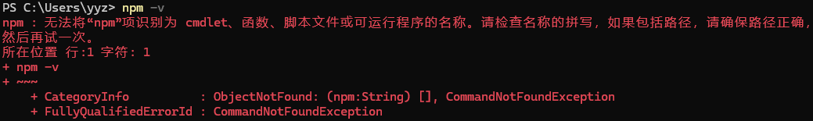

# Node.js

## x1 Windows11 PowerShell无法运行npm命令

错误信息如下：



原因：

- Restricted 执行策略不允许任何脚本运行。 

- AllSigned 和 RemoteSigned 执行策略可防止 Windows PowerShell 运行没有数字签名的脚本。

**解决方法：**

以**管理员身份**打开powershell

```powershell
get-executionpolicy # 查看 计算机上的现用执行策略
set-executionpolicy remotesigned # 或者Set-ExecutionPolicy Unrestricted (不安全)
```


