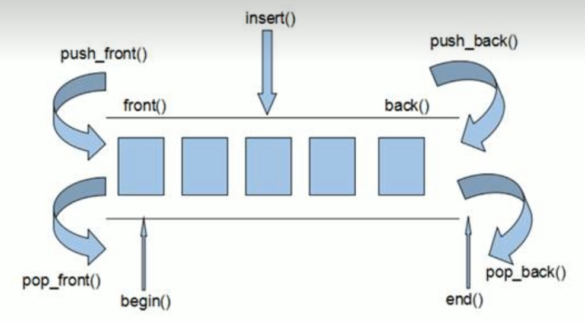
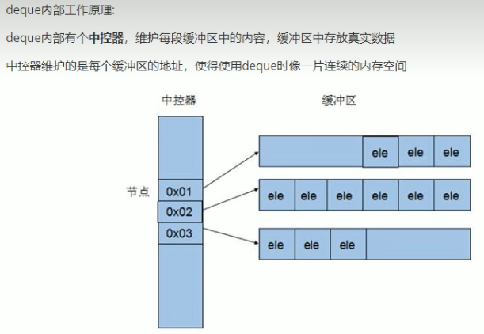

# Cpp - STL

**STL** - Strandard Template Library --标准模板库 --为了提高代码复用性

- **容器(Container)** - 数据结构
  - 序列式容器 - 强调值的排序
  - 关联式容器 - 二叉树结构
- **算法(Algorithm)** - 常用算法
  - 质变算法
  - 非质变算法
- **迭代器(Iterator)** - 容器与算法之间的胶合剂
- 仿函数 - 行为类似函数，可作为算法的某种策略
- 适配器（配接器）
- 空间配置器

## 1 String 字符串 容器

### 1.1 构造函数

**函数原型：**

- `string();`
- `string(const char* s);` // 使用字符串s初始化
- `string(const string& str);` // 拷贝构造
- `string(int n, char c);` // 使用n个c初始化

### 1.2 查找和替换

#### 查找

**find()**

函数原型：

- `int find(const string& str, int pos=0)` - 从左往右查

```c++
// find
std::string str = "abcde";
int pos = str.find("cd"); // pos = 2
int pos2 = str.find("不存在的字符"); // pos = -1
```

- `int rfind(const string& str, int pos=npos)` - 从右往左查

```c++
// rfind
std::string str = "abcdabcd";
int pos = str.rfind("d"); // pos = 7 - 即从右往左第一次出现的查找字符
int pos2 = str.rfind("不存在的字符"); // pos = -1
```

#### 替换

**replace()**

函数原型：

- `string& replace(int pos, int n, const string& str)` // **pos** 开始查找的位置，**n** 选中多少个字符，**str**替换成什么

```c++
std::string str = "abcde";
str.replace(1,2,"XXX"); // 结果为aXXXde
```

### 1.3 比较

**compare()**

- `int compare(const string &s) const;` 
  - 主要是用来比较 字符串是否相等

```c++
string str1 = "hello";
string str2 = "hello";
str1.compare(str2); // 相同为0，否则为1

str1 = "Zello";
str2 = "Aello";
str1.compare(str2); // 输出为1，即str1 > str2

str1 = "Aello";
str2 = "Zello";
str1.compare(str2); // 输出-1，即str1<str2

```

###  1.4 插入和删除

#### 插入

**insert()**

函数原型

- `string& insert(int pos ,const string& str);` // **pos**-从哪里开始插; **str**-插什么

```c++
string str = "hello";
str.insert(1,"XXX"); // 结果为 hXXXello
```

#### 删除

**erase()**

- `string& erase(int pos, int n);` // **pos**-从哪里开始删(包含pos); **n**-删多少

```c++
string str = "hello";
str.erase(1,3); // 结果为ho
```

### 1.5 子串 (切片)

**函数原型：**

- `string substr(int pos=0, int n=npos)` // **pos**-从哪里开始(包含pos); **n**-切多少

```c++
string str = "hello";
string str1 = str.substr(); // 结果为"hello" 相等于复制
string str2 = str.substr(1); // 结果为"ello" 等于从索引1开始复制
string str3 = str.substr(1,3); // 结果为"ell" 等于从1开始复制，复制3个元素
```

**实用案例：**

```c++
std::string str = "hello@qq.com";
int index = str.find('@');
std::cout << "username = " << str.substr(0,index) << std::endl;
std::cout << str.substr(index) << std::endl;

>>>
username = hello
@qq.com
```


## 2 Vector 容器

### 2.1 函数方法

- `empty();` // 判断容器是否为空
- `capacity();` // 返回容器的容量
- `size();` // 返回容器中元素的个数
- `rasize(int num, elem);` // 重新指定容器长度为num,若容器变长则以elem填充新位置，如果容器变短，则末尾超出容器长度的元素会被删除

### 2.2 插入和删除

- `push_back(ele);` // 尾部插入元素ele
- `pop_back();` // 删除最后一个元素
- `insert(const_inerator pos, ele);` // 迭代器指向位置pos插入元素ele
  - `insert(const_inerator pos, int count, ele);` // 迭代器指向位置插入count个元素ele
- `erase(const_iterator pos);` // 删除迭代器指向的对象
  - `erase(const_iterator start, const_itreator end);` // 删除迭代器指向的区间
- `clear();` // 删除容器中的所有元素

### 2.3 数据存取

- `at(int idx);` // 放回索引idx所指的数据  **↓ 等效**
- `operator[];` // 返回索引idx所指的数据 **↑ 等效**
- `front();` // 返回容器中的第一个元素
- `back();` // 返回容器中的最后一个元素

### 2.4 vector互换容器

`swap(vec);` - 将vec和本身的元素互换 **实现两个容器内元素进行互换**

**作用：节省内存** 

`vector<type>(vec).swap(vec)` - 巧用swap收缩内存

```c++
//例：
//vector 使用交换方法和匿名对象节省内存
void vector_HowToUse_swap_test2(){
    std::vector<int> v;
    for (int i = 0; i < 10000; ++i) {
        v.push_back(i);
    }
    std::cout << "存入了10000个数字" << std::endl;
    std::cout << "v的容量是 - " << v.capacity() << std::endl;
    std::cout << "v的大小是 - " << v.size() << std::endl;

    v.resize(3);
    std::cout << "重新设置大小后，v的容量是 - " << v.capacity() << std::endl;
    std::cout << "重新设置大小后，v的大小是 - " << v.size() << std::endl;

    std::vector<int>(v).swap(v);
    std::cout << "执行交换后，v的容量是 - " << v.capacity() << std::endl;
    std::cout << "执行交换后，v的大小是 - " << v.size() << std::endl;
}

>>>
存入了10000个数字
v的容量是 - 16384
v的大小是 - 10000
重新设置大小后，v的容量是 - 16384
重新设置大小后，v的大小是 - 3;
```

### 2.5 vector预留空间

**功能：减少vector在动态扩展容量时的扩展次数**

函数原型：`reserve(int len);` // 容器预留len个元素长度，预留位置不初始化，元素不可访问。

```c++
//vector 预留空间 reserve()方法
void vector_HowToUse_reserve(){
    std::vector<int> v1;
    int num = 0;//统计重新开辟内存的次数
    int *p = NULL;
    for (int i = 0; i < 100; ++i) {
        v1.push_back(i);
        if (p!=&v1[0]){ // 如果检测到指针地址变动了就num++
            p = &v1[0]; // 更新p为拓展后的vector地址
            num++;
        }
    }
    std::cout << "v1的内存开辟了"<<num<<"次"<<std::endl;
    //预留空间
    std::vector<int> v2;
    v2.resize(1000);
    int num2 = 0;//统计重新开辟内存的次数
    int *p2 = NULL;
    for (int i = 0; i < 100; ++i) {
        v2.push_back(i);
        if (p2!=&v2[0]){ // 如果检测到指针地址变动了就num++
            p2 = &v2[0];
            num2++;
        }
    }
    std::cout << "v2的内存开辟了"<<num2<<"次"<<std::endl;
}
```

## 3 Deque 双端数组 容器

**deque函数示意图：**



**deque与vector的区别：**

- vector对与头部的插入删除效率低，数据量越大，效率越低
- deque相对而言，对头部的插入删除速度比vector快
- vector访问元素时的速度会比deque快

**deque内部工作原理：**



deque容器的迭代器也是支持随机访问的

### 3.1 构造函数

- `deque<T> deqT;`
- `deque(beg, end);`
- `deque(n, elem);` // n个elem元素
- `deque(const deque &deq);` // 拷贝构造

### 3.2 赋值操作

- `deque& operator=(const deque &deq);`     // 重载等号操作符
- `assign(beg, end);`                                           // 将[beg, end) 区间中的数据拷贝赋值给本身
- `assign(n ,elem);`                                              // 将n个elem拷贝赋值给自身

### 3.3 容器大小操作

deque没有容量的定义，是可以无限拓展的，所以没有返回容量的方法

- `.empty();` // 判断容器是否为空
- `.size();` // 容器的大小(元素个数)
- `.resize(num);` // 重新设置容器的大小
  - `.resize(num, elem);` // 重新设置容器大小，若容器变长则以elem值填充新位置

### 3.4 插入和删除

两端插入操作：

- `push_back(elem);`  // 尾插
- `push_front(elem);` // 头插
- `pop_back(elem);` // 尾删
- `pop_front(elem);` // 头删

指定位置操作：

- `insert(pos, elem);` // 在pos位置**插入**elem的拷贝，返回新数据位置
  - `insert(pos, n, elem);` // 在pos位置插入n个elem数据，无返回值
  - `insert(pos, beg, end);` // 在pos位置插入[beg, end]区间的数据，无返回值
- `clear();` // **清空容器**所有数据
- `erase(pos);` // 删除pos位置的数据，返回下一个数据的位置
  - `erase(beg, end);` // **删除**[beg, end)区间的数据，返回下一个数据的位置

### 3.5 数据存取

- `at(int idx);` // 返回索引idx所指的数据
- `operator[];` // 返回索引idx所指的数据
- `front();` // 返回容器的第一个元素
- `back();` // 返回容器的最后一个元素

### 3.6 排序

利用算法实现对deque容器进行排序 , **默认从小到大**

- `sort(iterator beg, iterator end);` // 对[beg, end) 区间元素进行排序

```c++
//例
std::deque<int> deq;
deq.push_back(1);
deq.push_back(2);
deq.push_back(3);
deq.push_front(7);
deq.push_front(9);
deq.push_front(8);
Print_deque(deq);
std::sort(deq.begin(), deq.end()); // 排序
Print_deque(deq);

>>>
897123
123789
```

## 4 实战练习 - String + Vector + Deque

**代码：**[Player_Exercise.h](https://github.com/foryyz/Programming-Basic-Projects/blob/main/Cpp_STL_Exercise/Player_Exercise.h)

## 5 Stack 栈 容器

**概念：先进后出 (First In Last Out, FILO),它只有一个出口**


栈中只有顶端元素才能被外界使用，因此栈不允许有遍历行为

### 5.1 构造函数

- `stack<T> stk;`
  - `stack(const stack &stk);` // 拷贝构造

### 5.2 函数方法

- `stack& operator=(const stack &stk);` // 重载等号操作符
- `push(elem);` // 向栈顶添加元素
- `pop();` // 从栈顶移除第一个元素
- `top();` // 返回栈顶元素
- `empty();` // 判断是否为空
- `size();` // 返回栈的大小

## 6 Queue 队列 容器

queue **概念：先进先出 (First In First Out, FIFO),它有两个出口**


队列容器允许从一段新增元素，从另一端移除元素

队列中只有队头和队尾才可以被外界使用，因此队列不允许有遍历行为

队列中进数据成为 --- **入队** `push`

队列中出数据成为 --- **出队** `pop`

### 6.1 构造函数

- `queue<T> que;`
  - `queue(const queue &que);` // 拷贝构造

### 6.2 函数方法

- `queue& operator=(const queue &que);` // 重载等号操作符
- `push(elem);` // **入队**，从**队尾**添加元素
- `pop();` // **出队**，从**队头**移除第一个元素
- `back();` // 返回最后一个元素
- `front();` // 返回第一个元素
- `empty();` // 判断是否为空
- `size();` // 返回栈的大小

## 7 List 链表 容器

### 7.1 基本链表的定义

list **概念：**物理存储单元上非连续的存储结构，数据元素的逻辑顺序是通过链表中的指针链接实现

**功能：将数据进行链式存储**


组成：链表由一系列**结点**组成

**结点：**一个存储数据元素的**数据域**，另一个存储下一个结点地址的**指针域**

和数组相比：

- 优点
  - 可以对任意位置进行快速查找或删除元素
- 缺点
  - 链表遍历速度没有数组快
  - **占用空间比数组大**

### 7.2 STL中的链表

**STL中的链表是一个双向循环链表**


STL中的链表的迭代器只支持前移和后移，属于**双向迭代器**

- 优点
  - 采用动态存储分配，不会造成内存浪费和溢出
  - 链表执行插入和删除操作方便，修改指针即可
- 缺点
  - 链表灵活，但是空间(指针域)和时间(遍历)额外消耗较大

**List**有一个重要的性质，**插入操作和删除操作都不会造成原有list迭代器的失效**，这在vector是不成立的

总结：List和Vector是STL中最常用的容器

### 7.3 构造函数

- `list<T> lst;` // 默认构造
  - `list(const list &lst);` // 拷贝构造
- `list(beg, end);` // 将[beg, end) 区间的元素拷贝给本身
- `list(n, elem);` // 将n个elem拷贝给本身

### 7.4 函数方法

**list容器是双向迭代器**，只支持++,不支持+1,+2,+num...

##### 赋值和交换

- `assign(beg, end);` // 将[beg, end) 区间的数据拷贝赋值给本身
  - `assign(n, elem);` // 将n个elem拷贝赋值给本身
- `list& operator=(const list& lst);` / 重载等号操作符
- `swap(lst);` // 将lst与自身的元素互换

##### 大小操作

- `size();` // 返回容器中元素个数
- empty(); // 返回容器是否为空
- resize(num); // 重新制定容器的长度为num
  - resize(num, elem); // 重新指定容器长度为num，若容器变长则以elem填充新位置

##### 插入和删除

- `push_back(elem);` // 尾插
- `push_front(elem);` // 头插
- `pop_back();` // 尾删
- `pop_front();` // 头删
- `insert(pos, elem);` // 在pos插入elem
  - `insert(pos, n, elem);` // 在pos插入n个elem
  - `insert(pos, beg, end);` // 在pos插入[beg, end)
- `clear();` // 清空容器
- `erase(beg, end);` // 删除[beg, end)区间的数据
  - `erase(pos);` // 删除pos位置的数据，返回下一个数据的位置
- `remove(elem);` // 删除容器中所有与elem值匹配的元素

##### 数据存取

- `front()` // 返回第一个元素
- `back()` // 返回最后一个元素

**反转和排序**

- `reverse();` // 反转链表
- `.sort();` // 链表排序,链表的排序只能使用自身的.sort()方法，不能使用algorithm里的sort算法
  - 不支持随机访问迭代器的容器，内部会提供一些自身的特殊算法

```c++
//sort()的高级用法 , 可以为这个方法指定规则
bool myCompare(int v1,int v2){
    // 降序 就让第一个数 > 第二个数
    return v1>v2;
}
void list_HowToUse_reverseAndSort(){
	// ... lst = [1,3,4,2]
    lst.sort(myCompare);
    std::cout<< "回调函数排序 > " <<std::endl;
}
>>>   lst = [4,3,2,1]
```

### 7.5 排序案例

案例描述：按Person自定义数据类型进行排序，Person中有姓名，身高，年龄

排序规则：按照年龄升序，如果年龄相同按照身高进行降序

**代码：**[PersonSortExercise.h](https://github.com/foryyz/Programming-Basic-Projects/blob/main/Cpp_STL_Exercise/PersonSortExercise.h)


## 8 Set/multiset容器 和 Pair对组

简介：**所有元素都会在插入时自动被排序**

本质：set/multiset属于**关联式容器**，底层结构是用**二叉树**实现

**set和multiset区别**

- set不允许容器中有重复的元素
- multiset允许容器中有重复的元素

### 8.1 set 和 multiset 函数方法

创建set容器以及赋值,multiset将set改为`multiset`

- `set<T> st;` // 默认构造
  - `set(const set& st);` // 拷贝构造
- `set& operator=(const set& st);` // 等号重载

插入和删除

- `insert(elem);` // 插入数据, set会返回插入结果,类型为`pair<set<T>::iterator, bool>`,multiset返回迭代器pos
- `erase(elem);` // 删除容器中的elem元素
  - `erase(pos);` // 删除容器中pos位置的元素
  - `erase(beg, end);` // 删除[beg, end)区间元素
- `clear();`

容器操作

- `size();` // 返回容器元素个数，set容器不允许重新指定容器大小resize
- `empty();` // 判断容器是否为空
- `swap(st);` // 交换两个容器

**查找和统计**

- find(key); // 查找值key是否存在，若**存在则返回该键的迭代器**，若**不存在**，**返回set.end()**;
- count(key); // 统计key元素个数

### 8.2 pair 使用方法

创建

- `pair<type, type> p(value1, value2);`
- `pair<type, type> p = make_pair(value1, value2);`

### 8.3 改变set容器排序规则

技术点：利用**仿函数**改变排序规则

**set容器中插入自定义数据类型，都需要指定排序规则**

**例：**[set存放内置数据类型/set容器放自定义数据类型](https://github.com/foryyz/Programming-Basic-Projects/blob/main/Cpp_STL_Exercise/HowToUseSet.h)

## 9 Map/multimap 容器

- map中**所有元素都是pair**
- pair中第一个元素为key(键值)，起到索引作用，第二个元素为value(实值)
- 所有元素都**根据元素键值自动排序**

**本质：**map/multimap属于**关联式容器**，底层结构使用**二叉树**实现

**优点：**

- 可以根据key值快速找到value值

map和multimap**区别**：

- map不允许容器中有**重复key值**元素
- multimap允许容器中有重复key值

### 9.1 构造

- `map<T1, T2> mp;` // 默认构造
- `map(const map& mp);` // 拷贝构造
- `map& operator=(const map& mp);` // 重载等号运算符

### 9.2 函数方法

插入和删除

- `insert(pair<T1,T2>);` // 插入元素，**只接受pair**即对组格式
- `map[key];` // 直接对map对象使用[key]，则返回key对应的value，若不存在返回0
  - 可以直接通过 `map[key] = value;` 的方式插入新值
- `clear();` // 清空容器
- `erase(key);` // 删除键值为key的元素
  - `erase(pos);` // 删除pos迭代器所指的元素，返回下一个元素的迭代器
  - `erase(beg, end);` // 删除区间[beg, end) 之间的元素，返回下一个元素的迭代器

大小操作

- `size();` // 返回容器元素个数
- `empty();` // 判断容器是否为空
- `swap(mp);` // 交换两个集合容器

查找和统计

- `find(key);` // 查找key是否存在，存在返回该元素的迭代器，不存在返回set.end();
- `count(key);` // 统计key元素个数

排序

- 利用仿函数，改变排序规则

**例：**[HowToUseMap.h](https://github.com/foryyz/Programming-Basic-Projects/blob/main/Cpp_STL_Exercise/HowToUseMap.h)

## 10 函数对象

### 10.1 仿函数

**概念：**

- **重载函数调用操作符**的类，其对象称为**函数对象**
- **函数对象**使用重载的()时，行为类似函数调用，也叫**仿函数**

**本质：**

函数对象(仿函数)是一个**类**，不是一个函数

**特点：**

- 函数对象在使用时，可以像普通函数那样调用，可以有参数，可以有返回值
- 函数对象超出普通函数的概念，函数对象可以有自己的状态
- 函数对象可以作为参数传递

使用方法：**定义类，类中使用operator重载()**

**例：**[HowToUseFunctor.h](https://github.com/foryyz/Programming-Basic-Projects/blob/main/Cpp_STL_Exercise/HowToUseFunctor.h)

### 10.2 谓词

**概念：**

- **返回bool类型的仿函数**称为**谓词**
- 如果operator()接受一个参数，那么叫做一元谓词
- 如果operator()接受两个参数，那么叫做二元谓词

**案例：**

- 一元谓词
- 二元谓词

### 10.3 内建函数对象

**概念：** stl内建了一些函数对象

**分类：**

- 算术仿函数
- 关系仿函数
- 逻辑仿函数

**用法：**

- 这些仿函数产生的对象，用法和一般函数相同
- 使用内建函数对象，需要引入头文件`#include<functional>`

#### 10.3.1 算术仿函数

功能：

- 实现四则运算
- 其中negate是一元运算，其他都是二元运算

仿函数原型：

- `template<class T> T plus<T>` // 加法
- `template<class T> T minus<T>` // 减法
- `template<class T> T multiplies<T>` // 乘法
- `template<class T> T divides<T>` // 除法
- `template<class T> T modulus<T>` // 取模
- `template<class T> T negate<T>` //取反

示例：[HowToUseFunctorInSTL.h  Line=14](https://github.com/foryyz/Programming-Basic-Projects/blob/main/Cpp_STL_Exercise/HowToUseFunctorInSTL.h)

#### 10.3.2 关系仿函数

功能：实现关系对比

仿函数原型：

- `template<class T> bool equal_to<T>` // 等于
- `template<class T> bool not_equal_to<T>` // 不等于
- `template<class T> bool greater<T>` // 大于
- `template<class T> bool greater_equal<T>` // 大于等于
- `template<class T> bool less<T>` // 小于
- `template<class T> bool less_equal<T>` // 小于等于

示例：[HowToUseFunctorInSTL.h  Line=26](https://github.com/foryyz/Programming-Basic-Projects/blob/main/Cpp_STL_Exercise/HowToUseFunctorInSTL.h)

#### 10.3.3 逻辑仿函数

功能：实现逻辑运算

仿函数原型：

- `template<class T> bool logical_and<T>` // 逻辑 与
- `template<class T> bool logical_or<T>` // 逻辑 或
- `template<class T> bool logical_not<T>` // 逻辑 非

示例：

(该示例用了STL库中的 transfrom()算法) [HowToUseFunctorInSTL.h  Line=57](https://github.com/foryyz/Cpp_Basic_Exercise/blob/main/Cpp_STL_Exercise/HowToUseFunctorInSTL.h)


## 11 常用算法

### 11.1 常用遍历算法

- `for_each(iterator beg, iterator end, _func)` 遍历并执行函数对象
- `transform(iterator beg1, iterator end1, iterator beg2, _func)` - 搬运容器到另一个容器中
  - beg1 - 源容器开始迭代器，end1 - 源容器结束迭代器，beg2 - 目标容器开始迭代器
  - _func表示可以在搬运的同时对元素进行操作
    - 注意：搬运之前要先为目标容器开辟空间 vTarget.resize(v.size());

示例：[BasicAlgo_foreach.h](https://github.com/foryyz/Programming-Basic-Projects/blob/main/Cpp_STL_Exercise/BasicAlgo_foreach.h)

### 11.2 常用查找算法

- `find(iterator beg, iterator end, value)` // 查找元素
  - 查找beg到end间是否有元素value，找到返回指定位置，否则返回end位置
  - 查找元素可以为自定义类型对象，需要在对象类内 重写==方法: **operator==**
- `find_if(iterator beg, iterator end, _Pred)` // 按条件查找元素
  - 查找beg到end间是否有元素符合函数条件_Pred, 找到返回指定位置，否则返回end位置
- `adjacent_find(iterator beg, iterator end)` // 查找相邻重复元素
  - 返回**相邻且重复**元素的第一个位置的迭代器，否则返回end
- `binary_search(iterator beg, iterator end, value)` // 二分查找法
  - 查找指定元素是否存在，查到返回true,否则返回false
  - 在无序序列中不可用,必须是有序序列: set.如果是无序序列查找结果不保证正确性
- `count(iterator beg, iterator end, value)` // 统计元素个数
  - 统计自定义数据类型对象，需要在对象类内 重写==方法: **operator==**
- `count_if(iterator beg, iterator end, _Pred)` // 按条件统计元素个数

示例：[BasicAlgo_search.h](https://github.com/foryyz/Programming-Basic-Projects/blob/main/Cpp_STL_Exercise/BasicAlgo_search.h)

### 11.3 常用排序算法

- `sort(iterator beg, iterator end, _Pred)` // 按照谓词条件排序
  - 可以空缺谓词参数，默认升序排序
- `random_shuffle(iterator beg, iterator end)` // 洗牌
  - 指定范围内元素随机调整次序
    - 注：该算法已在C++17特性中被移除，使用shuffle替代
    - `std::shuffle(v.begin(),v.end(), std::mt19937(std::random_device()()));`
- `merge(iterator beg1, iterator end1, iterator beg2, iterator end2, iterator dest)` // 合并
  - 容器元素合并 并储存到另一容器(dest是目标容器)中，记得**提前给目标容器分配空间**
  - 注：两个容器必须是有序的, 合并时新容器也会自动排序
- `reverse(iterator beg, iterator end)` // 将容器内元素反转

示例：[BasicAlgo_sort.h](https://github.com/foryyz/Programming-Basic-Projects/blob/main/Cpp_STL_Exercise/BasicAlgo_sort.h)


## x1 一些问题

### 1 迭代器内的++

vector容器使用++

```c++
std::vector<int> vec;
vec.push_back(1);
vec.push_back(2);
vec.push_back(3);
for(std::vector<int>::iterator vit=vec.begin();vit!=vec.end();vit++){
    std::cout << *vit;
}
std::cout << "-vec遍历完成;"<<std::endl;
std::vector<int> vec2(vec.begin()++,vec.end());
std::vector<int> vec3(++vec.begin(),vec.end());
for(std::vector<int>::iterator vit=vec2.begin();vit!=vec2.end();vit++){
    std::cout << *vit;
}
std::cout << "-vec2遍历完成;"<<std::endl;
for(std::vector<int>::iterator vit=vec3.begin();vit!=vec3.end();vit++){
    std::cout << *vit;
}
std::cout << "-vec3遍历完成;"<<std::endl;

>>>
123-vec遍历完成;
123-lst遍历完成;
123-vec2遍历完成;
23-vec3遍历完成;
```
